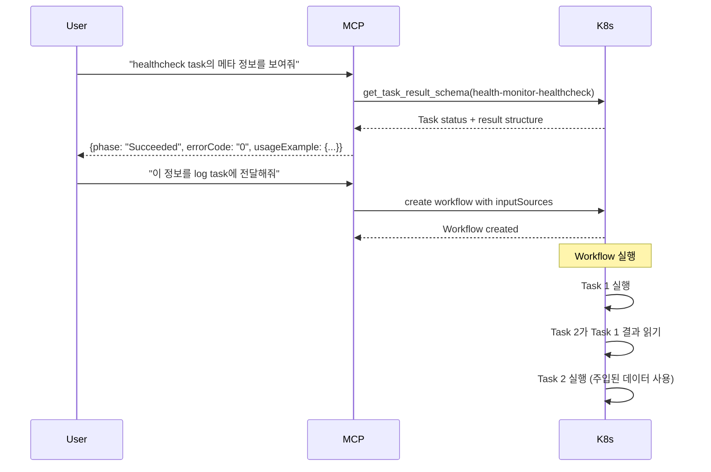

# Task 간 결과 전달 및 조건부 실행 설계

## 📋 개요

McallWorkflow에서 Task 간 결과를 전달하고, 이전 Task의 실행 결과에 따라 조건부로 다음 Task를 실행할 수 있도록 구조를 개선합니다.

## ❌ 현재 문제점

### 1. Task 간 격리
- **Task A의 실행 결과를 Task B가 알 수 없음**
- Dependencies는 완료 여부만 확인 (Succeeded인지만 체크)
- 조건부 실행 불가능 (성공 시 A, 실패 시 B 실행 불가)
- Task 결과를 다음 Task의 input으로 전달 불가

### 2. 메타 정보 접근성 부족
- **Task가 어떤 결과 데이터를 제공하는지 사전에 알 수 없음**
- Workflow 설계 시 추측으로 작업해야 함
- 디버깅 시 어떤 데이터를 확인해야 할지 불명확
- API를 통해 메타 정보를 조회할 방법이 없음

### 3. 현재 회피 방법의 한계
```bash
# 현재는 하나의 Task에 모든 로직을 넣어야 함
STATUS=$(curl -s -o /dev/null -w "%{http_code}" https://us.drillquiz.com)
if [ "$STATUS" = "200" ]; then
    echo "SUCCESS" >> /app/log/mcall/health.log
else
    echo "FAILED" >> /app/log/mcall/health.log
fi
```
- Workflow의 Task 분리 이점을 활용할 수 없음
- 재사용성 낮음
- 로직이 복잡해지면 유지보수 어려움

---

## 🎯 설계 목표

1. **Task 결과 스키마 조회 API**: Task가 제공하는 데이터를 API로 확인
2. **Task 간 결과 전달**: 이전 Task의 output, errorCode, phase 등을 다음 Task에 JSON으로 전달
3. **조건부 실행**: 성공/실패에 따라 다른 Task 실행
4. **타입 안정성**: 전달되는 데이터의 타입과 구조를 명확히 정의
5. **개발자 경험 향상**: MCP/CLI를 통해 Task 메타 정보를 쉽게 확인

---

## 🔧 상세 설계

## 1. Task 결과 스키마 조회 API

### 1.1 새로운 MCP Tools

#### Tool 1: `get_task_result_schema`
**목적**: Task 완료 후 제공되는 데이터 구조 확인

**입력**:
```json
{
  "name": "health-monitor-healthcheck",
  "namespace": "mcall-dev"
}
```

**출력**:
```json
{
  "status": "completed",
  "taskName": "health-monitor-healthcheck",
  "taskType": "get",
  "result": {
    "phase": {
      "value": "Succeeded",
      "type": "string",
      "description": "Task execution status",
      "possibleValues": ["Pending", "Running", "Succeeded", "Failed", "Skipped"]
    },
    "output": {
      "value": "<!doctype html>...",
      "type": "string",
      "description": "HTTP response body",
      "size": 5420,
      "preview": "<!doctype html><html>...",
      "isJSON": false
    },
    "errorCode": {
      "value": "0",
      "type": "string",
      "description": "Execution result code",
      "meaning": "Success",
      "possibleValues": ["0", "-1"]
    },
    "errorMessage": {
      "value": "",
      "type": "string",
      "description": "Error message if task failed"
    },
    "timing": {
      "startTime": "2025-10-09T16:20:49Z",
      "completionTime": "2025-10-09T16:20:50Z",
      "duration": "1.2s"
    }
  },
  "usageExample": {
    "description": "How to use this result in a dependent task",
    "inputSources": [
      {
        "name": "HEALTH_STATUS",
        "taskRef": "health-monitor-healthcheck",
        "field": "phase",
        "exampleValue": "Succeeded"
      },
      {
        "name": "HEALTH_ERROR_CODE",
        "taskRef": "health-monitor-healthcheck",
        "field": "errorCode",
        "exampleValue": "0"
      },
      {
        "name": "HEALTH_OUTPUT",
        "taskRef": "health-monitor-healthcheck",
        "field": "output",
        "exampleValue": "<!doctype html>..."
      }
    ],
    "workflowExample": "See section 3.3 for complete workflow example"
  }
}
```

#### Tool 2: `get_task_result_json`
**목적**: Task 결과를 간단한 JSON으로 조회

**입력**:
```json
{
  "name": "health-monitor-healthcheck",
  "namespace": "mcall-dev",
  "fields": ["phase", "errorCode"]
}
```

**출력**:
```json
{
  "taskName": "health-monitor-healthcheck",
  "taskType": "get",
  "phase": "Succeeded",
  "errorCode": "0"
}
```

### 1.2 CLI 명령어 추가

```bash
# Task 결과 스키마 조회
kubectl mcall task schema <task-name> [-n namespace]

# Task 결과 JSON 조회
kubectl mcall task result <task-name> [-n namespace] [--fields phase,errorCode,output]

# 예시
kubectl mcall task schema health-monitor-healthcheck -n mcall-dev
kubectl mcall task result health-monitor-healthcheck -n mcall-dev --fields phase,errorCode
```

---

## 2. Task 간 결과 전달 메커니즘

### 2.1 API 타입 확장

#### `api/v1/mcalltask_types.go`

```go
// McallTaskSpec defines the desired state of McallTask
type McallTaskSpec struct {
	Type         string            `json:"type"`
	Input        string            `json:"input"`
	Name         string            `json:"name,omitempty"`
	Timeout      int32             `json:"timeout,omitempty"`
	RetryCount   int32             `json:"retryCount,omitempty"`
	Schedule     string            `json:"schedule,omitempty"`
	Dependencies []string          `json:"dependencies,omitempty"`
	Environment  map[string]string `json:"environment,omitempty"`
	
	// 🆕 추가: 이전 Task 결과를 input으로 사용
	InputSources []TaskInputSource `json:"inputSources,omitempty"`
	
	// 🆕 추가: Input 템플릿 (변수 치환)
	InputTemplate string `json:"inputTemplate,omitempty"`
	
	// ... 기존 필드들 ...
}

// 🆕 TaskInputSource: 이전 Task의 결과를 참조
type TaskInputSource struct {
	// Name: 환경 변수 또는 템플릿 변수 이름
	Name string `json:"name"`
	
	// TaskRef: 참조할 task 이름 (workflow 내)
	TaskRef string `json:"taskRef"`
	
	// Field: 가져올 필드
	// - "output": Task 실행 결과 (HTTP 응답 본문, 명령어 출력 등)
	// - "errorCode": 실행 결과 코드 ("0" or "-1")
	// - "phase": Task 상태 ("Succeeded", "Failed" 등)
	// - "errorMessage": 에러 메시지
	// - "all": 모든 정보를 JSON으로
	Field string `json:"field"`
	
	// JSONPath: output이 JSON일 때 특정 필드 추출 (선택)
	// 예: "$.data.status", "$.items[0].name"
	JSONPath string `json:"jsonPath,omitempty"`
	
	// Default: Field를 찾을 수 없거나 Task가 실패했을 때 사용할 기본값
	Default string `json:"default,omitempty"`
}
```

#### `api/v1/mcallworkflow_types.go`

```go
// WorkflowTaskRef represents a reference to a McallTask in a workflow
type WorkflowTaskRef struct {
	Name         string         `json:"name"`
	TaskRef      TaskRef        `json:"taskRef"`
	Dependencies []string       `json:"dependencies,omitempty"`
	
	// 🆕 추가: 조건부 실행
	Condition *TaskCondition `json:"condition,omitempty"`
}

// 🆕 TaskCondition: Task 실행 조건
type TaskCondition struct {
	// DependentTask: 결과를 확인할 task 이름
	DependentTask string `json:"dependentTask"`
	
	// When: 실행 시점
	// - "success": 의존 task가 성공했을 때만
	// - "failure": 의존 task가 실패했을 때만
	// - "always": 의존 task 완료 시 항상
	// - "completed": 의존 task가 완료되면 (성공/실패 무관)
	When string `json:"when"`
	
	// FieldEquals: 특정 필드가 특정 값과 일치할 때
	// 예: {"field": "errorCode", "value": "0"}
	FieldEquals *FieldCondition `json:"fieldEquals,omitempty"`
	
	// OutputContains: output에 특정 문자열이 포함될 때
	OutputContains string `json:"outputContains,omitempty"`
}

// 🆕 FieldCondition: 필드 기반 조건
type FieldCondition struct {
	Field string `json:"field"`
	Value string `json:"value"`
}
```

### 2.2 Controller 로직

#### `controller/controller.go` - Input 주입

```go
func (r *McallTaskReconciler) handleRunning(ctx context.Context, task *mcallv1.McallTask) (ctrl.Result, error) {
	logger := log.FromContext(ctx)
	
	// 🆕 InputSources가 있으면 이전 Task 결과를 가져와서 주입
	if len(task.Spec.InputSources) > 0 {
		processedInput, envVars, err := r.processInputSources(ctx, task)
		if err != nil {
			logger.Error(err, "Failed to process input sources", "task", task.Name)
			task.Status.Phase = mcallv1.McallTaskPhaseFailed
			task.Status.Result = &mcallv1.McallTaskResult{
				ErrorCode:    "-1",
				ErrorMessage: fmt.Sprintf("Failed to process input sources: %v", err),
			}
			r.Status().Update(ctx, task)
			return ctrl.Result{}, err
		}
		
		// Input 치환
		if task.Spec.InputTemplate != "" {
			task.Spec.Input = processedInput
			logger.Info("Using processed input from template", "task", task.Name, "input", processedInput)
		}
		
		// 환경 변수 병합
		if task.Spec.Environment == nil {
			task.Spec.Environment = make(map[string]string)
		}
		for k, v := range envVars {
			task.Spec.Environment[k] = v
		}
		
		logger.Info("Injected data from input sources", 
			"task", task.Name, 
			"sourceCount", len(task.Spec.InputSources),
			"envVars", len(envVars))
	}
	
	// ... 기존 실행 로직 ...
}

// 🆕 processInputSources: InputSources 처리
func (r *McallTaskReconciler) processInputSources(ctx context.Context, task *mcallv1.McallTask) (string, map[string]string, error) {
	logger := log.FromContext(ctx)
	inputData := make(map[string]interface{})
	envVars := make(map[string]string)
	
	for _, source := range task.Spec.InputSources {
		// 참조 Task 가져오기
		var refTask mcallv1.McallTask
		err := r.Get(ctx, types.NamespacedName{
			Name:      source.TaskRef,
			Namespace: task.Namespace,
		}, &refTask)
		
		if err != nil {
			// Task를 찾을 수 없으면 Default 값 사용
			if source.Default != "" {
				logger.Info("Referenced task not found, using default value",
					"task", task.Name,
					"sourceTask", source.TaskRef,
					"defaultValue", source.Default)
				inputData[source.Name] = source.Default
				envVars[source.Name] = source.Default
				continue
			}
			return "", nil, fmt.Errorf("referenced task %s not found and no default value", source.TaskRef)
		}
		
		// Task가 아직 완료되지 않았으면 에러
		if refTask.Status.Phase != mcallv1.McallTaskPhaseSucceeded && 
		   refTask.Status.Phase != mcallv1.McallTaskPhaseFailed {
			return "", nil, fmt.Errorf("referenced task %s not completed yet (phase: %s)", 
				source.TaskRef, refTask.Status.Phase)
		}
		
		// Field에 따라 데이터 추출
		var value string
		switch source.Field {
		case "output":
			if refTask.Status.Result != nil {
				value = refTask.Status.Result.Output
				
				// JSONPath 처리
				if source.JSONPath != "" {
					extracted, err := extractJSONPath(value, source.JSONPath)
					if err != nil {
						logger.Error(err, "Failed to extract JSONPath", 
							"task", task.Name, 
							"sourceTask", source.TaskRef,
							"jsonPath", source.JSONPath)
						if source.Default != "" {
							value = source.Default
						} else {
							return "", nil, err
						}
					} else {
						value = extracted
					}
				}
			}
		case "errorCode":
			if refTask.Status.Result != nil {
				value = refTask.Status.Result.ErrorCode
			}
		case "phase":
			value = string(refTask.Status.Phase)
		case "errorMessage":
			if refTask.Status.Result != nil {
				value = refTask.Status.Result.ErrorMessage
			}
		case "all":
			// 모든 정보를 JSON으로
			allData := map[string]interface{}{
				"phase":          string(refTask.Status.Phase),
				"startTime":      refTask.Status.StartTime,
				"completionTime": refTask.Status.CompletionTime,
			}
			if refTask.Status.Result != nil {
				allData["output"] = refTask.Status.Result.Output
				allData["errorCode"] = refTask.Status.Result.ErrorCode
				allData["errorMessage"] = refTask.Status.Result.ErrorMessage
			}
			jsonBytes, _ := json.Marshal(allData)
			value = string(jsonBytes)
		default:
			return "", nil, fmt.Errorf("unknown field: %s", source.Field)
		}
		
		inputData[source.Name] = value
		envVars[source.Name] = value
		
		logger.Info("Extracted data from source task",
			"task", task.Name,
			"sourceTask", source.TaskRef,
			"field", source.Field,
			"varName", source.Name,
			"valuePreview", truncateString(value, 100))
	}
	
	// InputTemplate이 있으면 템플릿 렌더링
	if task.Spec.InputTemplate != "" {
		renderedInput := renderTemplate(task.Spec.InputTemplate, inputData)
		return renderedInput, envVars, nil
	}
	
	// InputTemplate이 없으면 JSON 문자열로 반환
	jsonBytes, err := json.Marshal(inputData)
	if err != nil {
		return "", nil, fmt.Errorf("failed to marshal input data: %w", err)
	}
	
	return string(jsonBytes), envVars, nil
}

// 🆕 renderTemplate: 템플릿 변수 치환
func renderTemplate(template string, data map[string]interface{}) string {
	result := template
	
	// ${VAR_NAME} 형식의 변수를 실제 값으로 치환
	for key, value := range data {
		placeholder := fmt.Sprintf("${%s}", key)
		valueStr := fmt.Sprintf("%v", value)
		result = strings.ReplaceAll(result, placeholder, valueStr)
	}
	
	return result
}

// 🆕 extractJSONPath: JSONPath 표현식으로 값 추출
func extractJSONPath(jsonStr string, path string) (string, error) {
	var data interface{}
	if err := json.Unmarshal([]byte(jsonStr), &data); err != nil {
		return "", fmt.Errorf("invalid JSON: %w", err)
	}
	
	// 간단한 JSONPath 구현 ($.field 형식)
	// 실제 구현 시 github.com/oliveagle/jsonpath 같은 라이브러리 사용
	path = strings.TrimPrefix(path, "$.")
	
	// 중첩된 필드 처리
	fields := strings.Split(path, ".")
	current := data
	
	for _, field := range fields {
		if m, ok := current.(map[string]interface{}); ok {
			current = m[field]
		} else {
			return "", fmt.Errorf("field %s not found in JSON", field)
		}
	}
	
	// 결과를 문자열로 변환
	switch v := current.(type) {
	case string:
		return v, nil
	case float64, int, bool:
		return fmt.Sprintf("%v", v), nil
	default:
		// 객체나 배열이면 JSON으로 직렬화
		jsonBytes, _ := json.Marshal(v)
		return string(jsonBytes), nil
	}
}

// 🆕 truncateString: 문자열 자르기 (로깅용)
func truncateString(s string, maxLen int) string {
	if len(s) <= maxLen {
		return s
	}
	return s[:maxLen] + "..."
}
```

#### `controller/controller.go` - 조건부 실행

```go
func (r *McallTaskReconciler) handlePending(ctx context.Context, task *mcallv1.McallTask) (ctrl.Result, error) {
	log := log.FromContext(ctx)

	// 🆕 Condition 체크 (Workflow에서 설정된 경우)
	if conditionStr, exists := task.Annotations["mcall.tz.io/condition"]; exists && conditionStr != "" {
		var condition TaskCondition
		if err := json.Unmarshal([]byte(conditionStr), &condition); err != nil {
			log.Error(err, "Failed to parse task condition", "task", task.Name)
			return ctrl.Result{}, err
		}
		
		shouldRun, err := r.checkTaskCondition(ctx, task, condition)
		if err != nil {
			log.Error(err, "Failed to check task condition", "task", task.Name)
			return ctrl.Result{}, err
		}
		
		if !shouldRun {
			log.Info("Task condition not met, skipping", "task", task.Name, "condition", condition)
			task.Status.Phase = mcallv1.McallTaskPhaseSkipped
			task.Status.Result = &mcallv1.McallTaskResult{
				ErrorCode:    "0",
				ErrorMessage: fmt.Sprintf("Skipped due to condition: %v", condition),
			}
			if err := r.Status().Update(ctx, task); err != nil {
				return ctrl.Result{}, err
			}
			return ctrl.Result{}, nil
		}
	}

	// Dependencies 체크
	if len(task.Spec.Dependencies) > 0 {
		allDepsReady, err := r.checkDependencies(ctx, task)
		if err != nil {
			return ctrl.Result{}, err
		}
		if !allDepsReady {
			log.Info("Dependencies not ready, skipping task", "task", task.Name)
			return ctrl.Result{RequeueAfter: 30 * time.Second}, nil
		}
	}
	
	// ... 기존 로직 ...
}

// 🆕 checkTaskCondition: Task 실행 조건 확인
func (r *McallTaskReconciler) checkTaskCondition(ctx context.Context, task *mcallv1.McallTask, condition TaskCondition) (bool, error) {
	// 의존 Task 가져오기
	var depTask mcallv1.McallTask
	if err := r.Get(ctx, types.NamespacedName{
		Name:      condition.DependentTask,
		Namespace: task.Namespace,
	}, &depTask); err != nil {
		return false, fmt.Errorf("dependent task %s not found: %w", condition.DependentTask, err)
	}
	
	// Task가 완료되지 않았으면 대기
	if depTask.Status.Phase != mcallv1.McallTaskPhaseSucceeded && 
	   depTask.Status.Phase != mcallv1.McallTaskPhaseFailed {
		return false, fmt.Errorf("dependent task %s not completed yet", condition.DependentTask)
	}
	
	// When 조건 확인
	switch condition.When {
	case "success":
		if depTask.Status.Phase != mcallv1.McallTaskPhaseSucceeded {
			return false, nil
		}
	case "failure":
		if depTask.Status.Phase != mcallv1.McallTaskPhaseFailed {
			return false, nil
		}
	case "always", "completed":
		// 완료만 확인
	default:
		return false, fmt.Errorf("unknown condition.when value: %s", condition.When)
	}
	
	// FieldEquals 조건 확인
	if condition.FieldEquals != nil {
		var actualValue string
		switch condition.FieldEquals.Field {
		case "errorCode":
			if depTask.Status.Result != nil {
				actualValue = depTask.Status.Result.ErrorCode
			}
		case "phase":
			actualValue = string(depTask.Status.Phase)
		default:
			return false, fmt.Errorf("unknown field for condition: %s", condition.FieldEquals.Field)
		}
		
		if actualValue != condition.FieldEquals.Value {
			return false, nil
		}
	}
	
	// OutputContains 조건 확인
	if condition.OutputContains != "" {
		if depTask.Status.Result == nil || 
		   !strings.Contains(depTask.Status.Result.Output, condition.OutputContains) {
			return false, nil
		}
	}
	
	return true, nil
}
```

#### `controller/mcallworkflow_controller.go` - Workflow에서 조건 설정

```go
func (r *McallWorkflowReconciler) createWorkflowTasks(ctx context.Context, workflow *mcallv1.McallWorkflow) error {
	log := log.FromContext(ctx)

	// Create tasks in dependency order
	tasksToCreate := r.sortTasksByDependencies(workflow.Spec.Tasks)

	for _, taskSpec := range tasksToCreate {
		// ... 기존 Task 생성 로직 ...
		
		task := &mcallv1.McallTask{
			ObjectMeta: metav1.ObjectMeta{
				Name:      fmt.Sprintf("%s-%s", workflow.Name, taskSpec.Name),
				Namespace: workflow.Namespace,
				Labels: map[string]string{
					"mcall.tz.io/workflow":      workflow.Name,
					"mcall.tz.io/task":          taskSpec.Name,
					"mcall.tz.io/original-task": taskRef.Name,
				},
				Annotations: make(map[string]string),
			},
			Spec: referencedTask.Spec,
		}

		// 🆕 Condition을 annotation에 저장
		if taskSpec.Condition != nil {
			conditionJSON, err := json.Marshal(taskSpec.Condition)
			if err != nil {
				log.Error(err, "Failed to marshal task condition", "task", taskSpec.Name)
				return err
			}
			task.Annotations["mcall.tz.io/condition"] = string(conditionJSON)
			
			log.Info("Set task condition", 
				"workflow", workflow.Name, 
				"task", taskSpec.Name,
				"condition", taskSpec.Condition)
		}

		// Update dependencies to use workflow task names
		task.Spec.Dependencies = r.convertDependencies(workflow.Name, taskSpec.Dependencies)

		if err := r.Create(ctx, task); err != nil {
			log.Error(err, "Failed to create task", "workflow", workflow.Name, "task", taskSpec.Name)
			return err
		}

		log.Info("Created task for workflow", "workflow", workflow.Name, "task", taskSpec.Name)
	}

	return nil
}
```

---

## 3. 사용 예시

### 3.1 Health Check with Conditional Logging

```yaml
apiVersion: mcall.tz.io/v1
kind: McallWorkflow
metadata:
  name: health-monitor
  namespace: mcall-dev
spec:
  schedule: '*/1 * * * *'
  tasks:
  
  # Task 1: Health Check
  - name: healthcheck
    taskRef:
      name: health-check-template
      namespace: mcall-dev
  
  # Task 2: Success 로깅 (healthcheck 성공 시만 실행)
  - name: log-success
    taskRef:
      name: log-success-template
      namespace: mcall-dev
    dependencies:
      - healthcheck
    condition:
      dependentTask: health-monitor-healthcheck
      when: success
    inputSources:
      - name: HEALTH_STATUS
        taskRef: health-monitor-healthcheck
        field: phase
      - name: COMPLETION_TIME
        taskRef: health-monitor-healthcheck
        field: completionTime
    inputTemplate: |
      echo "[${COMPLETION_TIME}] SUCCESS - ${HEALTH_STATUS} - us.drillquiz.com is UP" >> /app/log/mcall/health_monitor.log
      tail -20 /app/log/mcall/health_monitor.log
  
  # Task 3: Failure 로깅 (healthcheck 실패 시만 실행)
  - name: log-failure
    taskRef:
      name: log-failure-template
      namespace: mcall-dev
    dependencies:
      - healthcheck
    condition:
      dependentTask: health-monitor-healthcheck
      when: failure
    inputSources:
      - name: HEALTH_STATUS
        taskRef: health-monitor-healthcheck
        field: phase
      - name: ERROR_MESSAGE
        taskRef: health-monitor-healthcheck
        field: errorMessage
        default: "Unknown error"
      - name: COMPLETION_TIME
        taskRef: health-monitor-healthcheck
        field: completionTime
    inputTemplate: |
      echo "[${COMPLETION_TIME}] FAILED - ${HEALTH_STATUS} - ${ERROR_MESSAGE}" >> /app/log/mcall/health_monitor.log
      tail -20 /app/log/mcall/health_monitor.log
```

### 3.2 API 데이터 처리 예시

```yaml
apiVersion: mcall.tz.io/v1
kind: McallWorkflow
metadata:
  name: api-data-processor
  namespace: mcall-dev
spec:
  tasks:
  
  # Task 1: API 호출 (JSON 응답)
  - name: fetch-api-data
    taskRef:
      name: api-call-template
  # GET https://api.example.com/status
  # 응답: {"status": "ok", "activeUsers": 100, "errors": []}
  
  # Task 2: JSON 데이터 파싱 및 처리
  - name: process-api-data
    taskRef:
      name: process-template
    dependencies:
      - fetch-api-data
    inputSources:
      - name: API_STATUS
        taskRef: api-data-processor-fetch-api-data
        field: output
        jsonPath: $.status
      - name: USER_COUNT
        taskRef: api-data-processor-fetch-api-data
        field: output
        jsonPath: $.activeUsers
      - name: ERROR_COUNT
        taskRef: api-data-processor-fetch-api-data
        field: output
        jsonPath: $.errors.length
        default: "0"
    inputTemplate: |
      echo "API Status: ${API_STATUS}" >> /app/log/mcall/api.log
      echo "Active Users: ${USER_COUNT}" >> /app/log/mcall/api.log
      echo "Errors: ${ERROR_COUNT}" >> /app/log/mcall/api.log
      
      if [ "${API_STATUS}" != "ok" ]; then
        echo "ALERT: API is not healthy!" >> /app/log/mcall/api.log
      fi
      
      tail -20 /app/log/mcall/api.log
```

### 3.3 메타 정보 확인 워크플로우



---

## 4. MCP 서버 인터페이스

### 4.1 TypeScript 타입 정의

```typescript
// mcp-server/src/types.ts

export interface TaskInputSource {
  name: string;
  taskRef: string;
  field: 'output' | 'errorCode' | 'phase' | 'errorMessage' | 'all';
  jsonPath?: string;
  default?: string;
}

export interface TaskCondition {
  dependentTask: string;
  when: 'success' | 'failure' | 'always' | 'completed';
  fieldEquals?: {
    field: string;
    value: string;
  };
  outputContains?: string;
}

export interface WorkflowTaskWithCondition {
  name: string;
  type: 'cmd' | 'get' | 'post';
  input?: string;
  inputTemplate?: string;
  inputSources?: TaskInputSource[];
  dependencies?: string[];
  condition?: TaskCondition;
  timeout?: number;
}
```

### 4.2 새로운 Tools

```typescript
// mcp-server/src/tools.ts

export const GetTaskResultSchemaSchema = z.object({
  name: z.string().describe("Task name"),
  namespace: z.string().optional().describe("Kubernetes namespace"),
});

export const GetTaskResultJsonSchema = z.object({
  name: z.string().describe("Task name"),
  namespace: z.string().optional().describe("Kubernetes namespace"),
  fields: z.array(z.string()).optional().describe("Fields to extract: output, errorCode, phase, errorMessage, all"),
});

export const TOOLS = [
  // ... 기존 tools ...
  
  {
    name: "get_task_result_schema",
    description: "Get the result schema and metadata of a completed task. Shows what data is available for use in dependent tasks, including field types, possible values, and usage examples.",
    inputSchema: zodToJsonSchema(GetTaskResultSchemaSchema),
  },
  
  {
    name: "get_task_result_json",
    description: "Get task execution result in structured JSON format. Useful for extracting specific fields to pass to dependent tasks.",
    inputSchema: zodToJsonSchema(GetTaskResultJsonSchema),
  },
];
```

---

## 5. 구현 단계

### Phase 1: 메타 정보 조회 API (우선순위: 높음)
- [ ] `get_task_result_schema` MCP tool 구현
- [ ] `get_task_result_json` MCP tool 구현
- [ ] KubernetesClient에 해당 함수 추가
- [ ] CLI 명령어 추가 (kubectl mcall task schema)
- [ ] 테스트 및 문서화

**예상 소요**: 1-2일

### Phase 2: Task 간 결과 전달 (우선순위: 높음)
- [ ] API 타입에 `InputSources`, `InputTemplate` 추가
- [ ] CRD 재생성
- [ ] Controller에 `processInputSources` 함수 구현
- [ ] 템플릿 렌더링 로직 구현
- [ ] JSONPath 추출 로직 구현
- [ ] 테스트 케이스 작성

**예상 소요**: 2-3일

### Phase 3: 조건부 실행 (우선순위: 중간)
- [ ] API 타입에 `Condition` 추가
- [ ] CRD 재생성
- [ ] Controller에 `checkTaskCondition` 함수 구현
- [ ] Workflow controller에서 condition annotation 설정
- [ ] `Skipped` phase 추가 및 처리
- [ ] 테스트 케이스 작성

**예상 소요**: 2-3일

### Phase 4: 고급 기능 (우선순위: 낮음)
- [ ] JSONPath 고급 기능 (배열 인덱싱, 필터링)
- [ ] 복잡한 조건문 지원 (AND, OR, NOT)
- [ ] Task 결과 캐싱 (동일 Task 여러 번 참조 시)
- [ ] Result 변환 함수 (base64, jq 등)

**예상 소요**: 3-5일

---

## 6. 사용 시나리오

### 시나리오 1: 헬스체크 기반 로깅

```bash
# Step 1: healthcheck task 생성 및 실행
curl -X POST https://mcp-dev.drillquiz.com/mcp -d '{
  "method": "tools/call",
  "params": {
    "name": "create_mcall_task",
    "arguments": {
      "name": "site-health",
      "type": "get",
      "input": "https://us.drillquiz.com"
    }
  }
}'

# Step 2: Task 결과 메타 정보 확인
curl -X POST https://mcp-dev.drillquiz.com/mcp -d '{
  "method": "tools/call",
  "params": {
    "name": "get_task_result_schema",
    "arguments": {
      "name": "site-health",
      "namespace": "mcall-dev"
    }
  }
}'

# 응답으로 사용 가능한 필드 확인:
# - phase: "Succeeded"
# - errorCode: "0"
# - output: "<!doctype html>..."

# Step 3: 이 정보를 사용하는 Workflow 생성
curl -X POST https://mcp-dev.drillquiz.com/mcp -d '{
  "method": "tools/call",
  "params": {
    "name": "create_mcall_workflow",
    "arguments": {
      "name": "health-monitor",
      "tasks": [
        {
          "name": "healthcheck",
          "type": "get",
          "input": "https://us.drillquiz.com"
        },
        {
          "name": "log-success",
          "type": "cmd",
          "dependencies": ["healthcheck"],
          "condition": {
            "dependentTask": "healthcheck",
            "when": "success"
          },
          "inputSources": [
            {"name": "STATUS", "taskRef": "healthcheck", "field": "phase"},
            {"name": "ERROR_CODE", "taskRef": "healthcheck", "field": "errorCode"}
          ],
          "inputTemplate": "echo SUCCESS: ${STATUS} code=${ERROR_CODE} >> /app/log/mcall/health.log"
        },
        {
          "name": "log-failure",
          "type": "cmd",
          "dependencies": ["healthcheck"],
          "condition": {
            "dependentTask": "healthcheck",
            "when": "failure"
          },
          "inputSources": [
            {"name": "ERROR_MSG", "taskRef": "healthcheck", "field": "errorMessage"}
          ],
          "inputTemplate": "echo FAILED: ${ERROR_MSG} >> /app/log/mcall/health.log"
        }
      ]
    }
  }
}'
```

### 시나리오 2: Cursor/Claude에서 사용

```
사용자: "healthcheck task가 어떤 데이터를 제공하는지 보여줘"

AI: [get_task_result_schema 호출]
     "healthcheck task는 다음 정보를 제공합니다:
      - phase: Succeeded (Task 상태)
      - errorCode: 0 (성공 코드)
      - output: HTML 응답 본문
      
      다음 task에서 이렇게 사용할 수 있습니다:
      inputSources:
        - name: HEALTH_STATUS
          taskRef: healthcheck
          field: phase"

사용자: "healthcheck가 성공하면 SUCCESS를, 실패하면 FAILED를 로그에 남기는 workflow 만들어줘"

AI: [create_mcall_workflow 호출 with conditions]
     "✅ Workflow 생성 완료!
      - healthcheck 성공 시 → log-success 실행
      - healthcheck 실패 시 → log-failure 실행"
```

---

## 7. 데이터베이스 스키마 (PostgreSQL Logging)

### 7.1 기존 스키마
```sql
CREATE TABLE monitoring_logs (
    id SERIAL PRIMARY KEY,
    service_name VARCHAR(255),
    service_type VARCHAR(50),
    status VARCHAR(50),
    error_message TEXT,
    response_time_ms BIGINT,
    timestamp TIMESTAMP
);
```

### 7.2 확장 제안
```sql
-- Task 간 관계 추적
ALTER TABLE monitoring_logs ADD COLUMN workflow_name VARCHAR(255);
ALTER TABLE monitoring_logs ADD COLUMN task_name VARCHAR(255);
ALTER TABLE monitoring_logs ADD COLUMN parent_task VARCHAR(255);
ALTER TABLE monitoring_logs ADD COLUMN result_json JSONB;

-- 인덱스 추가
CREATE INDEX idx_workflow_task ON monitoring_logs(workflow_name, task_name);
CREATE INDEX idx_timestamp ON monitoring_logs(timestamp DESC);

-- Task 결과 조회 뷰
CREATE VIEW task_results AS
SELECT 
    workflow_name,
    task_name,
    status,
    result_json->>'phase' as phase,
    result_json->>'errorCode' as error_code,
    timestamp,
    response_time_ms
FROM monitoring_logs
WHERE task_name IS NOT NULL
ORDER BY timestamp DESC;
```

---

## 8. 마이그레이션 계획

### 8.1 하위 호환성
- 기존 Workflow는 그대로 작동
- `InputSources`와 `Condition`은 선택 사항
- 새 필드 없이도 기존처럼 동작

### 8.2 단계별 마이그레이션
1. **Phase 1**: 메타 정보 조회 API 추가 (기존 시스템에 영향 없음)
2. **Phase 2**: InputSources 기능 추가 (opt-in)
3. **Phase 3**: Condition 기능 추가 (opt-in)
4. **Phase 4**: 기존 Workflow를 새 기능으로 점진적 마이그레이션

---

## 9. 테스트 계획

### 9.1 Unit Tests
- [ ] `getTaskResultSchema` 함수 테스트
- [ ] `getTaskResultJson` 함수 테스트
- [ ] `processInputSources` 함수 테스트
- [ ] `checkTaskCondition` 함수 테스트
- [ ] JSONPath 추출 로직 테스트

### 9.2 Integration Tests
- [ ] 조건부 실행 workflow 테스트
- [ ] Task 결과 전달 workflow 테스트
- [ ] JSONPath를 사용한 데이터 추출 테스트
- [ ] 에러 케이스 처리 테스트

### 9.3 E2E Tests
- [ ] MCP를 통한 메타 정보 조회 테스트
- [ ] Health monitoring workflow 전체 시나리오
- [ ] API 데이터 처리 workflow 시나리오

---

## 10. 성능 고려사항

### 10.1 Task 결과 조회 최적화
- Task 결과는 Kubernetes API에서 조회 (캐시 활용)
- 큰 output은 preview만 반환
- 필요한 필드만 선택적으로 조회

### 10.2 JSONPath 처리
- 간단한 경로 ($.field)는 직접 구현
- 복잡한 경로는 라이브러리 사용 (github.com/oliveagle/jsonpath)
- output 크기 제한 (예: 1MB 이상이면 에러)

---

## 11. 보안 고려사항

### 11.1 데이터 접근 제어
- Task 결과는 같은 namespace 내에서만 접근 가능
- RBAC 설정으로 Task 조회 권한 관리

### 11.2 민감 데이터 처리
- 환경 변수에 민감 정보가 있을 수 있음
- output에 비밀번호 등이 포함될 수 있음
- 로그 출력 시 민감 정보 마스킹 필요

---

## 12. 향후 확장 가능성

### 12.1 고급 데이터 변환
```yaml
inputSources:
  - name: USER_COUNT
    taskRef: api-call
    field: output
    jsonPath: $.users
    transform: "parseInt"  # 문자열 → 숫자
    
  - name: STATUS_UPPER
    taskRef: health-check
    field: phase
    transform: "toUpperCase"  # 대문자 변환
```

### 12.2 복합 조건
```yaml
condition:
  and:
    - dependentTask: health-check
      when: success
    - dependentTask: api-call
      fieldEquals:
        field: errorCode
        value: "0"
```

### 12.3 결과 집계
```yaml
# 여러 healthcheck 결과를 하나로 집계
inputSources:
  - name: ALL_HEALTH_CHECKS
    taskRefs: 
      - us-health
      - eu-health
      - asia-health
    field: all
    aggregate: true  # 배열로 반환
```

---

## 13. 문서화 계획

- [ ] API 레퍼런스: 새로운 필드 및 타입 문서화
- [ ] 사용 가이드: Task 간 결과 전달 예시
- [ ] 마이그레이션 가이드: 기존 Workflow 업그레이드 방법
- [ ] 트러블슈팅 가이드: 일반적인 문제 및 해결책

---

## 14. 예상 이점

### 14.1 개발자 경험
- ✅ Task 설계 시 명확한 입출력 정의
- ✅ 디버깅 용이 (각 Task 결과를 독립적으로 확인)
- ✅ Workflow 재사용성 증가

### 14.2 운영 효율성
- ✅ 복잡한 로직을 여러 Task로 분리 가능
- ✅ 조건부 실행으로 불필요한 작업 제거
- ✅ 에러 처리 및 알림 자동화

### 14.3 AI 통합
- ✅ AI가 Task 메타 정보를 보고 자동으로 Workflow 구성
- ✅ 자연어로 복잡한 Workflow 생성 가능
- ✅ 에러 발생 시 AI가 원인 파악 가능

---

## 15. 참고 자료

- Argo Workflows: Task output artifacts
- Tekton Pipelines: Task results and parameters
- Apache Airflow: XCom (cross-communication)
- GitHub Actions: Job outputs

---

## 작성자

- 작성일: 2025-10-09
- 버전: 1.0
- 상태: 설계 단계

